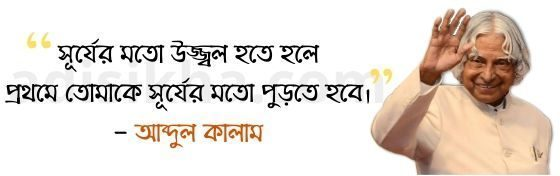
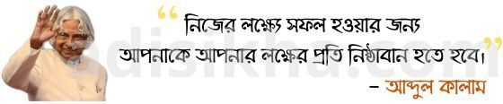
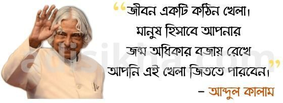
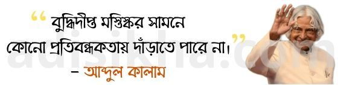
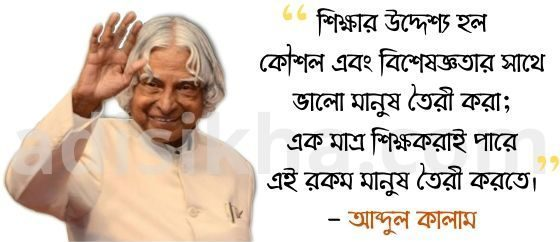

তামিলনাড়ুর রামেশ্বরমের সাধারণ এক পরিবারে ১৯৩১ সালের ১৫ই অক্টোবর  জন্ম হয় এপিজে আব্দুল কালামের। তখন রামেশ্বরম বৃটিশ ভারতের  মাদ্রাস প্রেসিডেন্সির অন্তর্গত ছিল। তাঁর বাবার নাম জয়নুল আবেদীন এবং মায়ের নাম আশিয়াম্মা। তাঁর জীবনে তাঁর বড় বোন জোহরা এবং ভগ্নিপতি আহামাদ জালালুদ্দীনেরও অনেক প্রভাব ছিল। আব্দুল কালামের খুব ছোট বয়স থেকেই আকাশে উড়ার শখ ছিল । সাগর পাড়ে বড় হওয়া কীশোর কালাম যখন আকাশে পাখি দের ঊড়তে দেখতেন তাঁর মনে তাদের মতো খোলা আকাশে ঊরে বেড়ানোর ইচ্ছা জাগতো ( সোর্সঃ “wings of fire” by APJ Abdul Kalam) । এবং মজার ব্যাপার হচ্ছে রামেশ্বরম থেকে আকাশে উড়তে পারা প্রথম মানুষটি হলে যুবক বয়েসের সেই কালাম। তিনি তাঁর শিক্ষা জীবন শুরু করেন রামনাথপুরামের সোয়ার্জ ম্যট্রিকুলেশন বিদ্যালয়ে। সেখান থেকে সাধারন শিক্ষা সমাপ্ত করে মাদ্রাস বিশ্ববিদ্যালয়ের অধীনে তিরুচিরাপল্লীর সেন্ট জোসেফ কলেজ থেকে পদার্থ বিদ্যায় ডিগ্রী অর্জন করেন।

তিনি তাঁর পদার্থ বিদ্যার স্নাতক শেষ করেই অনুধাবন করতে পারেন যে, আসলে পদার্থবিদ্যা তাঁর জন্য উপযুক্ত সাব্জেক্ট ছিলনা। তিনি ছোটবেলা থেকে আকাশে উড়ার যে স্বপ্ন নিয়ে বেড়ে উঠেছেন সে স্বপ্নের পথ এই সাবজেক্টের শেষপ্রান্তে পাওয়া যাবেনা। তাই তিনি ১৯৫৫ সালে মাদ্রাস ইন্সটিটিউট অব টেকনোলজি ( MIT) তে ভর্তী হতে মনস্থির করেন। কিন্তু তখন এম আই টির ভর্তির ফিস দেয়ার মতো যোগ্যতা তাঁর ছিলনা। তখন তাঁর বড় বোন জোহরা তাঁর সোনার গহনা বিক্রি করে আব্দুল কালামকে ভর্তীর টাকা দেন।

এম আইটি তে পড়ার সময় আব্দুল কালাম প্রায়ই অবসর সময়ে সেখানে রাখা একটি পরিত্যাক্ত বিমানের পাশে ঘন্টার পর ঘন্টা বসে থাকতেন এবং নিজের আকাশে ঊড়ার স্বপ্নকে আরো মজবুত করতেন। কালাম ছোটবেলা থেকেই খুব একটা মেধাবী ছিলেন না, কিন্তু কঠোর পরিশ্রমী ছিলেন ।  MIT তে একবার তাঁর একটি প্রজেক্টে অখুশি ডীন তাকে প্রজেক্টোটী  নির্ধারিত সময়ের মধ্যে শেষ করতে না পারলে স্কলারশিপ বন্ধের ভয় দেখালে তিনি সে প্রজেক্ট তি দিনের মধ্যে শেষ করেন।

এম আই টিতে শিক্ষাজীবন শেষ করার পর জীবন তাঁর সামনে দুইটি রাস্তা খুলে দেয়। এবং দুইটি রাস্তাই তাকে তাঁর স্বপ্ন পুরন করতে সক্ষম ছিল।  একটি ভারতীয় বিমান বাহিনীর চাকুরী অন্যটি ছিল ভাতীয় মিনিষ্ট্রি অফ ডিফেন্সে ডাইরেক্টর অব টেকনিক্যাল ডেভেলপমেন্ট এন্ড প্রোডাকশনের। এবং তিনি একই সাথে দুটিতে আবেদন করে বসলেন। এবং এমন সময় দুই জায়গা থেকেই তাকে ইন্টারভিয়ের জন্য ডাকা হলো। এবং ইন্টারভিয়ের স্থান দুটি ভারতের দুই প্রান্তে ছিল ২০০০ কি.মি দূরে। জীবনে প্রথমবার আব্দুল কালাম বিমানে সফর করলেন। এবং অবাক হয়ে আকশ থকে নিজের জন্মভুমীকে দেখলেন।

দুইটি ইন্টারভিউ দিয়ে তিনি ফিরে আসলেন। এয়ার ফোর্সে ২৫ জন ক্যন্ডীডেট এর মধ্যে হলেন নবম। চরম হতাশ হলেন তিনি । এয়ার ফোর্সে তাঁর যাওয়া হলোনা। কিন্তু কিয়েকদিন পরেই ডিফেন্স মিনিষ্ট্রিতে তাঁর ডাক পরলো এবং সেখানে সিনিয়ার সাইন্টিস্ট এসিস্টেন্ট  হিসিবে জয়েন করেন। এখান থেকেই শুরু হয় তাঁর জীবনের উত্থানের গল্প । এখান তাঁর মেধা এবং কাজের প্রতি নিষ্ঠা দেখে তাকে ইন্ডিয়ান স্পেস রিসার্চ প্রোগ্রামে পদায়ন করা হয়। সেখান থেকে রকেট সাইন্সের উপর প্রশিক্ষণ নিতে তাকে আমেরিকায় পাঠানো হয়। তাঁর হাত ধরেই ভারতের রকেট টেকনোলোজির বিশাল উন্নতি সাধিত হয় এবং তিনি  “মিসাইলম্যান” , “ইন্ডিয়ান মিসাইল ম্যান” উপাধি পান। ১৯৯৮ সালে ভারতের প্রথম সফল পারমাণবিক পরীক্ষা পোখরান-২  তাঁর হাত ধরেই সফলতা পায়। তিনি ১৯৮১ সালে পদ্মভূষণ , ১৯৯০তে পদ্ম বিভূষণ এবং ১৯৯৭ সালে ভারতের সর্বোচ্চ সম্মাননা ভারতরত্ন উপাধি সহ বিভিন্ন দেশি – বিদেশী পদক সম্মানে ভূষিত হন।

১৫ আক্টোবর ১৯৯১তে তিনি ৬০ বছরে পদার্পণ করেন এবং নিজের রিটায়ার্মেন্ট এর অপেক্ষায় ছিলেন। ইচ্ছা ছিল গরীব বাচ্চাদের জন্য একটি স্কুল খুলবেন সেখানে তাদের শিক্ষাদিবেন  এবং নিজের জীবনের অভিজ্ঞতা যা মানুষের কাজে লাগবে তা লিখিত আকারে সংরক্ষণ করে যাবেন। করছিলেনও তাই। কিন্তু ২০০২ সালে ভারতীয় জনতা পার্টি এবং কংগ্রেসের ভারতের সবচেয়ে বড় দুই দলের মতামতের ভিত্তিতে ২০০৭ সাল পর্যন্ত ভারতের রাষ্ট্রপতির দায়িত্ব পালন করেন।

তিনি মানুষের মাঝে জ্ঞান ছড়িয়ে দিতে পছন্দ করতেন। ভালবাসতেন নিজের জীবনের শিক্ষা তরুণ পজন্মের মাঝে পৌঁছে দিতে । তেমনই  ২০১৫ সালে ২৭শে জুলাই মেঘালয়ের শিলং শহরে অবস্থিত ইন্ডিয়ান ইনস্টিটিউট অব ম্যানেজমেন্ট নামক প্রতিষ্ঠানে বসবাসযোগ্য পৃথিবী বিষয়ে বক্তব্য রাখছিলেন । ভারতীয় সময় ৬টা ৩০ মিনিটে বক্তব্য রাখা অবস্থায় তাঁর হার্ট এ্যটাক হয় এবং তাকে বেথানী হাসপাতালে নিয়ে যাওয়া হলে ৭টা ৪৫ মিনিট নাগাদ তাঁর মৃত্যু ঘটে ।

৮৪ বছর বয়সে দেশের জন্য নিজের সমগ্র জীবন উৎসর্গ করে যাওয়া এ মহাপুরুষ পরলোক গমন করেন। ২৯শে জুলাই তাঁর জন্মস্থান রামেশ্বরমেই তাকে দাফন করা হয়। তিনি তাঁর কর্মজীবনে দেশের সেবায় পার করেন এ সময়ে তাঁর পরিবার পরিজন বলতে ছিল অসংখ্য বই এর একটি আলমারি এবং দেশের মানুষের ভালবাসা। দেশ এবং দেশের মানুষই ছিল তাঁর পরিবার ,এদের ছেড়ে বিয়ে এবং সংসার করা তাঁর হয়ে উঠেনি। তাঁর মৃত্যুতে ভারতে ৭ দিনের জাতীয় শোক পালন করা হয়।

