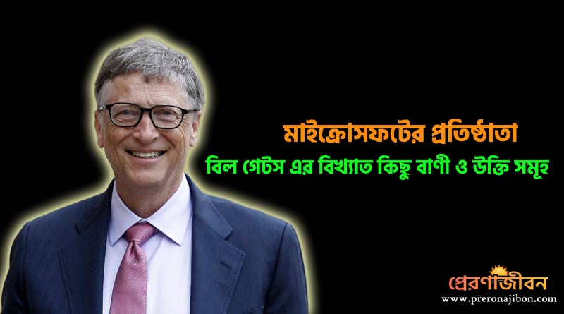
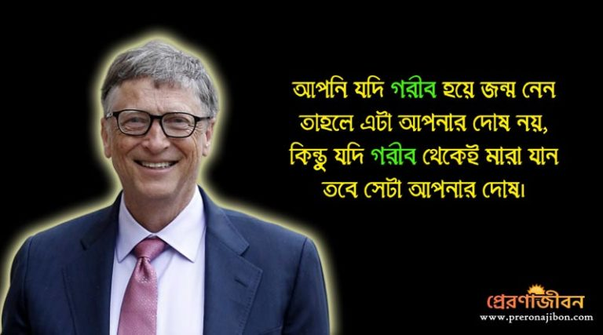
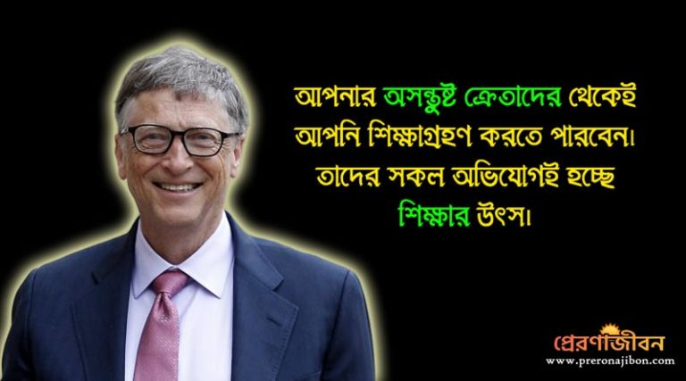
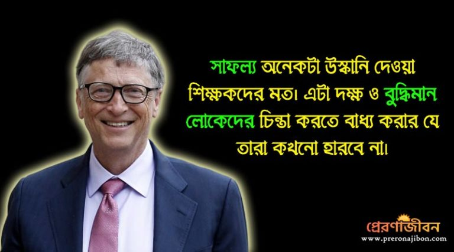

১.“জীবন কতগুলো পরীক্ষার সেমিষ্টারে বিভক্ত নয়। এখানে কোনই গ্রীষ্মকালীন ছুটি নেই এবং খুব কম সংখ্যক লোকই তোমার সার্মথ্য চেনাতে সাহায্য করতে আসবে।”

২. “একবার পরীক্ষায় কয়েকটা বিষয়ে আমি ফেল করেছিলাম কিন্তু আমার বন্ধু সব বিষয়েই পাশ করে। এখন সে মাইক্রোসফটের একজন ইঞ্জিনিয়ার আর আমি মাইক্রোসফটের প্রতিষ্ঠাতা।”

৩.“যখন তোমার পকেট ভর্তি টাকা থাকবে তখন শুধুমাত্র তুমি ভুলে যাবে যে ‘তুমি কে’; কিন্তু যখন তোমার পকেট ফাঁকা থাকবে তখন সমগ্র দুনিয়া ভুলে যাবে ‘তুমি কে’!”

৪.“আপনি যদি গরীব হয়ে জন্ম নেন তাহলে এটা আপনার দোষ নয়, কিন্তু যদি গরীব থেকেই মারা যান তবে সেটা আপনার দোষ।”

৫.” নিজেকে পৃথিবীর কারোর সাথেই তুলোনা করবেন না। যদি তা করেন, তাহলে আপনি নিজেই নিজের অপমান করছেন।”

৬.“যদি আপনি ভুল করেন তাহলে সেটা আপনার বাবা-মায়ের ভুল নয়, ওটা আপনারই ভুল। তাই ভুল করার জন্য দুঃখ না পেয়ে, সেটার থেকে শিখুন।”

৭. “প্রতিদিন নিজের সেরাটা দিতে হবে।”

৮.“আমাদের প্রচুর টাকা ঢালতে হবে আমাদের স্বভাবের পিছনে, যদি তা আমরা বদলাতে চাই।”

৯.“আপনি যদি কোনো কিছু ভালোভাবে না করতে পারেন, অন্তত চেষ্টা করুন।”

১০.“মানুষ সর্বদাই পরিবর্তনকে ভয় পায় । যখন বিদ্যুৎ আবিষ্কার হয়েছিলো, তখনও মানুষ সেটাকে ভয় পেয়েছিলো।”

১১.“পৃথিবীর কেউই আপনার মূল্য নিয়ে ভাবেনা, সবাই আপনার কাছ থেকে কিছু প্রত্যাশা করে।“

১২.“আমি মনে করি যে, গরিবদের পিছনে বিনয়োগের রিটার্ন ততটাই রোমাঞ্চকর হয়, যতটা একটি ব্যবসায়িক ক্ষেত্রে অর্জন করা সাফল্য । আর এটা ব্যবসার থেকেও অধিক সার্থকপূর্ণ হয়ে থাকে।”

১৩.“যখন আমরা গরিবদের জন্য বিনিয়োগ করি তখন আমরা ভবিষ্যতকে আরো মজবুত বানাই, নাকি আমরা তাদের যন্ত্রণার উপর জোর দিই।“

১৪.“আপনার অসন্তুষ্ট ক্রেতাদের থেকেই আপনি শিক্ষাগ্রহণ করতে পারবেন। তাদের সকল অভিযোগই হচ্ছে শিক্ষার উৎস।”

১৫.“মাইক্রোসফ্ট লোভের দ্বারা নয় বরং নতুন উদ্ভাবন ও নিরপেক্ষতার দ্বারা তৈরী হয়েছে।”

১৬.“আমি সম্ভবত মেন্টাল সাইকেলের মাত্র ১০ শতাংশ ব্যবহার করি ব্যবসার জন্য ভাবার ক্ষেত্রে । ব্যবসা করা এতটাও কঠিন নয়।”

১৭.“ তিনবছর পর হয়তো আমার কোম্পানীর সব প্রোডাক্টই বেকার হয়ে যেতে পারে। প্রশ্ন শুধু এটাই যে, আমরা কি সেগুলোকে বেকার বানাই নাকি অন্য কেউ বানায়?।“

১৮.“মহান সংস্থাগুলি, জড়িত মানুষদের থেকে উচ্চ স্তরের প্রতিভা পাওয়ার আশা করেই থাকে।“

১৯.“বড় কিছু পেতে গেলে, আপনাকে অনেক সময় বড় ঝুঁকি নিতে হবে।”

২০.“পিসি ওপেন করার সময় থেকেই মানুষ জানতো যে এটা গুরুত্বপূর্ণ,”

২১.”সবচেয়ে অসাধারণ দাতা সেই হয়, যে বাস্তবে একটি সার্থক বলিদান দিচ্ছে।“

২২.“প্রযুক্তি শুধু একটি উপকরণ মাত্র ।ছোটদের একসঙ্গে কাজ করার ও তাদের অনুপ্রাণিত করার জন্য শিক্ষকের ভূমিকা অত্যন্ত গুরুত্বপূর্ণ।“

২৩.”পরোপকার করার জন্য সৃজনশীলতার প্রয়োজন হয়ে থাকে। ঠিক যেমন পরিমান ধ্যান আর কৌশল একটা ব্যবসাকে তৈরী করার জন্য প্রয়োজন।“

২৪.“সাফল্য একটি পরিপূর্ণ শিক্ষক, এটি স্মার্ট মানুষদের চিন্তার মধ্যে ঢুকিয়ে দেয় তারা কখনো ব্যর্থ হবেনা।“

২৫.”ধৈর্য্যই হলো সাফল্যের প্রধান শর্ত।“

২৬.”সফলতার উৎযাপন করা ভালো, তবে ব্যর্থতার দিকেও নজর দিতে হবে।”

২৭.“ সাফল্য অনেকটা উস্কানি দেয়া শিক্ষকদের মত। এটা দক্ষ ও বুদ্ধিমান লোকদের চিন্তা করতে বাধ্য করায় যে তারা কখনো হারবে না। ”

২৮.“একজন সবচেয়ে ভালো শিক্ষক ভীষন ইন্টারেক্টিভ হয়।“

২৯.“সবচেয়ে অসুখী মানুষের প্রতি লক্ষ্য করুন, অনেক কিছু শিখতে পারবেন।“

৩০.“আমি কোনো কঠিন কাজ করার জন্য সবসময় একজন অলস ব্যক্তিকে পছন্দ করবো, কারণ সে ওই কাজটি করার একটি সহজ উপায় বের 
করবে।”
