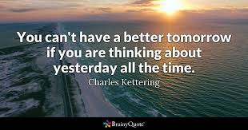

একজন তরুণ যুবক যিনি ছিলেন ‘জেনারেল মোটর্স রিসার্চ কর্পোরেশনের ‘ ভাইস প্রেসিডেন্ট । তিনি বন্ধুদের বললেন যে একটা ছোট্ট চাবি দিয়ে গাড়িগুলো স্টার্ট করা যেতে পারে । কিন্তু বন্ধুরা হেসে উড়িয়ে দিলেন তার কথাটি । এবং যারা শুনলেন সকলেই বললেন যে , অসম্ভব কল্পনা তার । আর তার খেয়ালি কল্পনার জন্য মজাও করতে ছাড়লেন না । বললেন যে , “একটা ছোট্ট চাবি দিয়ে এত বড় মোটর গাড়িকে স্টার্ট করা সম্ভব নয় ।” কিন্তু আজ আমরা জানি যে এটাও সম্ভব হয়েছে । এখন একটা ছোট্ট চাবি দিয়ে অর্থাৎ সেল্ফ স্টার্টারের মাধ্যমে গাড়ি স্টার্ট করা যায় ।

তার নাম চার্লস ফ্রাঙ্কলিন ক্যাটারিং ( Charles Franklin Kettering) । সংক্ষেপে চার্লস এফ ক্যাটারিং নামেই পরিচিত আজ । যিনি এই অসাধ্য সাধন করতে পেরেছিলেন । তিনি যখন গাড়ির সেল্ফ স্টার্ট এর আবিষ্কারের স্বপ্ন দেখতেন । তখন তার এই স্বপ্ন পূরণের জন্য প্রয়োজন ছিল প্রচুর সময় এবং পরিশ্রম । বাধ্য হয়েই তিনি চাকরিটি ছেড়ে দেন । যে কোনো গবেষণার জন্য অর্থেরও প্রয়োজন । চাকরি না থাকায় তাঁর অর্থের অভাব দেখা দিল । তাঁর ব্যাংক ব্যালান্স ফুরোতে লাগলো । একটা সময় সবই ফুরিয়ে গেল । তখনও চার্লস ক্যাটারিং সফল হতে পারলেন না । একটার পর একটা প্রচেষ্টা ব্যর্থ হতে লাগলো । গবেষণা চালিয়ে যাবার জন্য আরো পয়সার প্রয়োজন হতে লাগলো । হতাশ হয়ে কাজ বন্ধ করে দেবেন , নাকি কাজ চালিয়ে যাবেন । তিনি জমি জমা গয়না ইত্যাদি বিক্রি করতে লাগলেন । একটা সময় সেসবও ফুরিয়ে গেল । শেষ সম্বল রইলো পৈতৃক সম্পত্তি চাষের খেত আর বসত বাড়িটি । পৈতৃক সম্পত্তি আর ফিরে পাওয়া যায় না , তাই তিনি বসত বাড়িটি বিক্রি করে দিলেন । আর ক্ষেতের এক ধারে কুঁড়ে ঘর বানিয়ে স্ত্রী সন্তানকে নিয়ে বাস করতে লাগলেন ।

গভীর গবেষণায় তিনি এতই নিমগ্ন যে , আত্মীয় বন্ধুদের থেকে বিচ্ছিন্ন হতে লাগলেন । তার উপর বন্ধু , আত্মীয় সকলেই তার স্ত্রীকে বললেন যে তিনি কেন এত পাগলামি মেনে নিচ্ছেন ? সন্তানদের ভবিষ্যৎ নেই ?
কিন্তু তাঁর স্ত্রী বললেন যে তারা তো কষ্ট করছেনই , কিন্তু ক্যাটারিং সাহেব নিজে যে এত পরিশ্রম করছেন নিজের শরীরের দিকে তাকানোর পর্যন্তও অবসর নেই -এটাই তাকে বেশি চিন্তায় রাখছে । অর্থাৎ তার স্ত্রী স্বামীর কাজকে, তার অধ্যবসায়কে সমর্থনই করছেন ।
এত কিছু সত্ত্বেও চার্লস ক্যাটারিং কিন্তু বিশ্বাসে অটল ছিলেন যে , তিনি একদিন সফল হবেন । দীর্ঘ কয়েক বছর পর অবশেষে তাঁর স্বপ্ন সফল হলো । তিনি যেদিন সেল্ফ স্টার্টের প্রদর্শন করেন , সে দিন সকলেই অবাক । সমস্ত মোটর শিল্পের লোকেরা তার টেকনিক কিনে নিতে লাগলেন আর দেখতে দেখতে তিনি অনেক অর্থের মালিক হয়ে উঠলেন ।

বিশ্বের বিখ্যাত সব পত্র পত্রিকা তাঁকে ঘিরে ধ’রে তাঁর সাফল্যের কারণ জানতে চাইলো । ” অনেক অনেক বাধার পরেও নিজের লক্ষ্য পূরণ করেই ছাড়লেন , আপনার এতো ধৈর্যের উৎস কী ? ”

এর উত্তর দেওয়ার জন্য ক্যাটারিং সাংবাদিককে তাঁর সেই কুঁড়ে ঘরে নিয়ে গেলেন , আর ঘরের সমস্ত জিনিসের মাঝে থেকে একটা ছোট্ট পাথর বের করে দেখালেন আর বললেন , ” এটাই আমার সাফল্যের উৎস “।

তাহলে বন্ধুরা , দেখো এই গল্প থেকে আমরা যে শিক্ষাগুলি নিতে পারি সেগুলি হলো :

১। যারা ‘আজ’ নিয়ে বাঁচে তারাই সফল হয় ।

২। দুনিয়ার সমস্ত কাজ আসলে ‘আজ’ই সম্পন্ন হয় ।

৩। তাই বর্তমানকে নিয়ে বাঁচাই সাফল্যের মূল সূত্র ।

৪। এখন নয়তো কক্ষণো নয় ।

৫। প্রতিটি সময়ই মূল্যবান । তাই সময়ের সঠিক ব্যবহার করা উচিত ।
